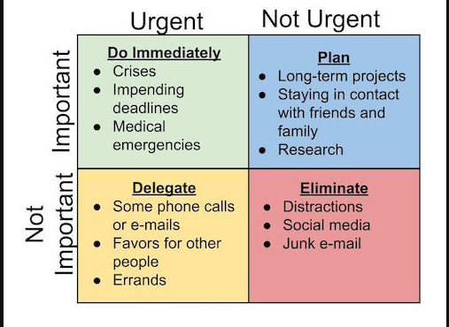
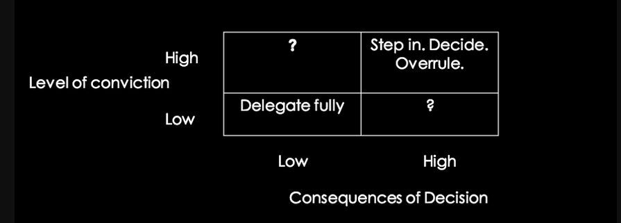
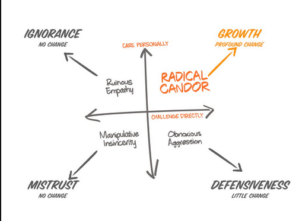

Super Thinking is one of the best books I have read recently. It acts as a compendium of multiple tools and techniques that can help in exapanding one's thinking capabilities.
The book is written by Lauren McCann , a statistician and researcher with numerous medical publications to her name. Her co-author Gabriel Weinberg is the CEO of the internet search company DuckDuckGo, which is a privacy focused browser(it does not track you like google).
## Essence of the book
I have tried to document a few actionable insights that I gained from the book. Please note that these are my own thoughts and ideas that were influenced by the book or pre-existing ideas that were refined.
### Matrix-Models for decisions
Whenever faced with a dilemma regarding choices, matrix-models can be quite helpful.  As in a mathematical matrix, we create a box-like structure and evaluate our choices based on the options. We could have cost vs benefit or pros vs cons when choosing between choices. Some prominent matrix models discussed in the book are:
Eisenhower Decision Matrix:

The Consequence-Conviction Matrix:

Radical Candor Matrix for offering feedback:

### Biases
Humans unconsciously have a lot of biases. For example, people might wrongly assume that flights are not safe compared to car rides. However, statistically, car accidents occur lot more often than airplane crashes. But the media focus on the gory details of a crash more than the banal accident on the highway. And that affects our thinking. Always look out for the facts behind an opinion. And be ready to change opinions when presented with counterfactual evidence. Although this might be difficult when we're all a part of echo chambers on social media, I'd like to stress that verifying and cross-checking "facts" is one great way to steer clear fromt he negative effects of biases. Most often, there is no black-and-white and the answer lies in a gray area. Also, correlation may not imply causation. So always be on the lookout for a "third variable".

The book delves into a lot of other biases and they're all mentioned in the takeways below. I also highly recommend reading Nobel Laureates Kahneman and Tversky's seminal book "Thinking Fast and Slow" for further look into biases. 

### Adaptability
Being adaptive requires having multiple(but not too much) options to avoid any "path dependence". Adaptiveness is necessary for innovation and the flexibility it lends to our lives. One key component of this is to always have an "exit strategy". For example, if you're starting up, and the venture blows up, you should have enough capital to survive for sometime while you look for the next opportunity. Also note that past events are not a predictor for future consequences so be ready for any eventuality. 

The "unknown unknowns" or the events that we do not know about, might occur and wreck our plans (Covid-19, anyone?). Such events, called Black Swans, can be better prepared against by incorporating a more robust scenario-analysis in our thinking. Prepare for the worst, hope for the best.
### Productivity
Becoming productive entails a few changes in our mindset which involve among other things, recognizing the value of Pareto's 80-20 principle: 80% of rewards come from 20% of efforts. Focusing on the strong few skills that we have and reducing the 20% most distracting activities can work wonders.
Reframing a problem can help to understand more nuances which might have been previously missed. Thinking through multiple lenses and often in "other people's shoes" can unlock patterns that bring us closer to the solution. A different framing might also help when dealing with other people. It certainly helps when companies push the same product's advertisment but with different words to convince different demographics.

## Key Takeaways
These notes are almost entirely taken from the "Key Takeaways" at the end of each chapter. They are to serve as a ready reckoner to look up these notes myself.
### Being Wrong Less
- Objective Thinking => Argue from FIRST PRINCIPLES, Get to the ROOT CAUSE and seek the THIRD STORY
- Our views may be influenced because of AVAILABILITY BIAS, OPTIMISTIC PROBABILITY BIAS, FUNDAMENTAL ATTRIBUTION ERROR etc
- Investigate the simplest and respectful objective explanations using OCKHAM's RAZOR and HANLON'S RAZOR and then DE-RISK those assumptions while avoiding PREMATURE-OPTIMIZATION.
- THINK IN GRAY to avoid CONFIRMATION BIAS
- Bypass the FILTER BUBBLE by becoming the DEVIL'S ADVOCATE.

### Anything that can go wrong, will
- EXTERNALITIES can cause SPILLOVER EVENTS(bad health effects causing factory pollution), which can be fixed using intervention(regulation) or COASE THEOREM(such as by CAP AND TRADE)
- PUBLIC GOODS (like education) are particularly susceptible to the TRAGEDY OF THE COMMONS (like poor schools) via the FREE-RIDER PROBLEM (not paying taxes)
- ASYMMETRIC INFORMATION can lead to PRINCIPAL-AGENT PROBLEMS
- GOODHART'S LAW=>rewards on measurable incentives can cause unintended consequences.
- SHORT-TERMISM can lead to TECH-DEBT and create disadvantageous PATH-DEPENDENCE, which can be mitigated by PRESERVING OPTIONALITY with PRECAUTIONARY PRINCIPLE.
- Decisions are REVERSIBLE AND IRREVERSIBLE. Avoid ANALYSIS PARALYSIS for the former.
- Heed Murphy's Law.

### Spend your time wisely
- Follow your NORTH STAR
- Avoid MULTITASKING and always have ONE IDEA AT THE TOP OF YOUR MIND
- Use OPPORTUNITY COST and EISENHOWER MATRIX (urgent vs important) to select options and tasks.
- Use 80/20 rule to increase LEVERAGE
- Stop at DIMINISHING RETURNS and avoid NEGATIVE RETURNS.
- Use COMMITMENT and the DEFAULT EFFECT to avoid PRESENT BIAS, and PERIODIC EVALUATIONS to avoid LOSS-AVERSION and SUNK-COST FALLACY.
- Shortcut via DESIGN PATTERNS and ALGORITHMS and consider REFRAMING THE PROBLEM.

### Becoming one with nature
- Adopting an experimental mindset => NATURAL SELECTION + SCIENTIFIC METHOD
- Respect INERTIA => Create/Join healthy FLYWHEELS, avoid STRATEGY TAXES unless there is a CATALYST and a lot of POTENTIAL ENERGY
- Reach CRITICAL MASS for TECHNOLOGY ADOPTION LIFECYCLE
- FORCING FUNCTIONS can grease the wheels for change
- Cultivate LUCK SURFACE AREA without getting subsumed by ENTROPY
- Avoid ZERO-SUM/BLACK-WHITE situations and look for WIN-WIN opportunities

### Lies, Damned lies and Statistics
- Avoid succumbing to the GAMBLER'S FALLACY or the BASE RATE FALLACY
- CORRELATION DOES NOT IMPLY CAUSATION. Keep that in mind while forming HYPOTHESES based on ANECDOTAL EVIDENCE. 
- Experiments should be RANDOMISED CONTROLLED and AB tested which can show STATISTICAL SIGNIFICANCE 
- NORMAL DISTRIBUTION + CENTRAL LIMIT THEOREM=> 68% values within 1 standard deviation, 95% within two.
- SELECTION BIAS || RESPONSE BIAS || SURVIVORSHIP BIAS in data can lead to FALSE POSITIVE or FALSE NEGATIVE.
- SYSTEMATIC REVIEW or META-ANALYSIS helps in increasing confidence in a result due to replication.
- Calculated or reported values may be uncertain when dealing with uncertainty, hence use ERROR BARS.

### Decisions, Decisions
- COST-BENEFIT + DECISION TREE are better than a simple pros/cons list
- To uncover key drivers, use SENSITIVITY ANALYSIS and look for any DISCOUNT RATES.
- SYSTEMS THINKING + SCENARIO ANALYSIS can uncover Black Swans or unknown unknowns.
- SIMULATIONS may be the best solution in cases.
- Use LATERAL+DIVERGENT THINKING to deal with GROUPTHINK.
- Strive to look for GLOBAL OPTIMUM and make decisions to get yourself closer to it.

### Dealing with Conflict
- Game Theory lens => PRISONER'S DILEMMA, ULTIMATUM GAME , WAR OF ATTRITION.
- Influence models => RECIPROCITY + COMMITMENT + LIKING + SOCIAL PROOF + SCARCITY + AUTHORITY. Beware of DARK PATTERNS.
- Framing/POV => SOCIAL VS MARKET NORMS, DISTRIBUTIVE VS PROCEDURAL JUSTICE, APPEAL TO EMOTION.
- Prefer DETERRENCE and CONTAINMENT.
- Change the game with GUERILLA tactics + ABOVE_THE_WEIGHT punches
- Be aware of the LAST WAR and know your EXIT STRATEGY.

### Unlocking people's potential
- Always manage the person
- Avoid PETER PRINCIPLE=> promoting to roles where they succeed
- DRI => directly responsible individual
- DELIBERATE PRACTICE for improvement, CONSEQUENCE-CONVICTION MATRIX for opportunites, RADICAL CANDOR for 1:1s
- Watch out for DUNNING-KRUGER EFFECT and IMPOSTOR SYNDROME
- Winning Hearts and Minds is Culture :) 

### Flex your Market Power
- Find a SECRET and build around it, searching via CUSTOMER DEVELOPMENT for PRODUCT/MARKET FIT
- Navigate the IDEA-MAZE by being a HEAT-SEEKING MISSILE, looking for RESONANT FREQUENCY for validation
- Find BRIGHT SPOTS or PIVOT
- Build a MOAT to create SUSTAINABLE COMPETITIVE ADVANTAGE
- ONLY THE PARANOID SURVIVE => INNOVATE DISRUPTIVELY and CROSS THE CHASM

